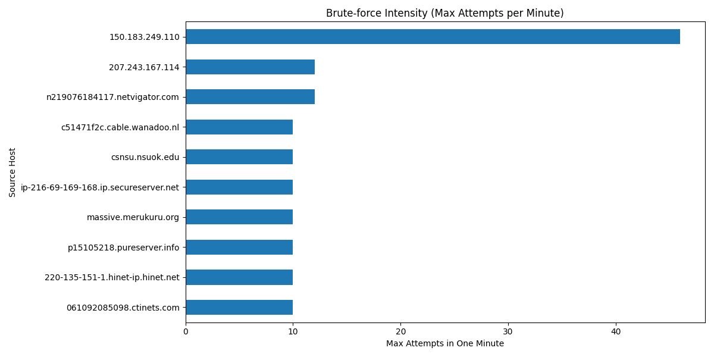
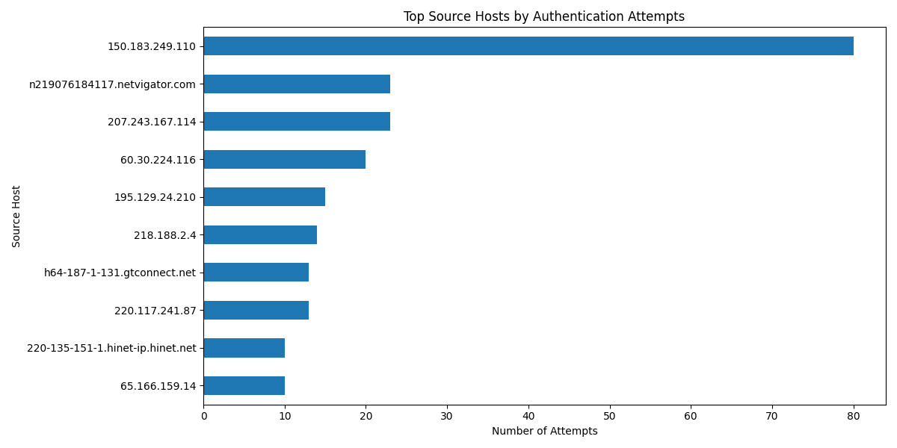
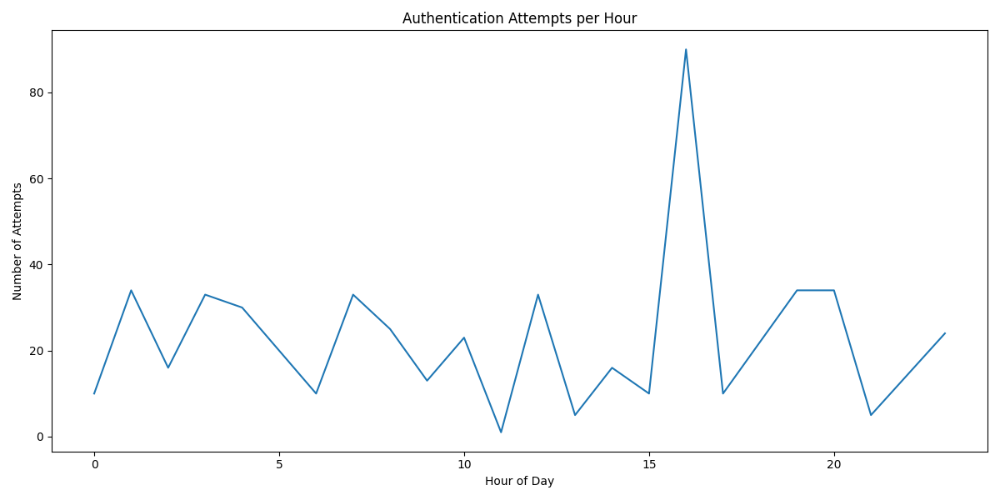

# Linux SSH Log Analysis 

This project simulates an **analysis of Linux SSH authentication logs**.

The objective is to:

- Filter noisy system logs
- Extract structured authentication events
- Detect brute-force behavior using time-based aggregation
- Generate statistical insights and visualizations

The project demonstrates log parsing, regex extraction, data transformation,
behavioral detection logic, and analytical reporting.

---

## Dataset
Source:  
https://www.kaggle.com/datasets/ggsri123/linux-logs

The original dataset was filtered to retain only SSH/authentication-related
events before structured analysis.

---

## How It Works

1. **Log Filtering**
   - Remove unrelated system events
   - Keep only SSH/authentication-relevant entries

2. **Log Parsing (`analyzer.py`)**
   - Extract:
     - Timestamp
     - Source host (`rhost`)
     - Username
     - Raw log line
   - Export structured dataset to CSV

3. **Data Preparation (`utils.py`)**
   - Filter events with identifiable source hosts
   - Convert timestamps to datetime (assumed year)
   - Create derived time features:
     - Hour of day
     - Minute bucket (for brute-force detection)

4. **Brute-force Detection (`analyses.py`)**
   - Group by `rhost` + 1-minute window
   - Count authentication attempts
   - Flag suspicious windows above threshold (≥ 5 attempts/minute)
   - Export detection results

5. **Visual Analysis (`visualizations.py`)**
   - Generate:
     - Top source hosts
     - Authentication attempts per hour
     - Brute-force intensity per host

---

## Key Findings

- Multiple source hosts exhibited high-frequency authentication attempts.
- One host generated **46 login attempts within a single minute**, strongly
  indicating automated brute-force behavior.
- Authentication activity is concentrated among a small subset of source hosts,
  suggesting targeted or scripted attack behavior.
- Activity patterns are consistent with automated credential attacks rather than manual login attempts.

---

## Visualizations

### Brute-force Intensity



Shows the maximum number of authentication attempts performed by a single source host within a one-minute window.
The presence of 46 attempts in a single minute strongly indicates automated attack behavior. Human-driven login attempts typically occur at a much lower frequency and do not produce such burst patterns.


---

### Top Source Hosts



Displays the hosts responsible for the highest number of authentication attempts.
This uneven distribution suggests scanning or scripted targeting rather than organic multi-user access patterns. A small number of external sources account for a disproportionately high volume of authentication attempts.


---

### Authentication Attempts per Hour



Illustrates temporal distribution of authentication activity throughout the day.
Such clustering may indicate automated execution windows (e.g., scripted attacks running at scheduled intervals) rather than random manual access attempts.

---

## How to Run

### Requirements

- Python 3.11+
- See `requirements.txt`

Install dependencies:

```bash
pip install -r requirements.txt
```
Execute Analysis
```bash
python scripts/analyses.py
```
Generate Visualizations
```bash
python scripts/visualizations.py
```

### Documentation
Detailed reasoning and methodology can be found in:

- `docs/PROJECT_NOTES.md` 

---

### Notes
•	This project is intentionally iterative.

•   The assumed year is artificial (added during preprocessing).

•	Parsing logic and analysis will evolve as skills improve.

---

## Author
Sara Oliveira
- [LinkedIn](https://www.linkedin.com/in/sara-oliveira-055a35278/)

